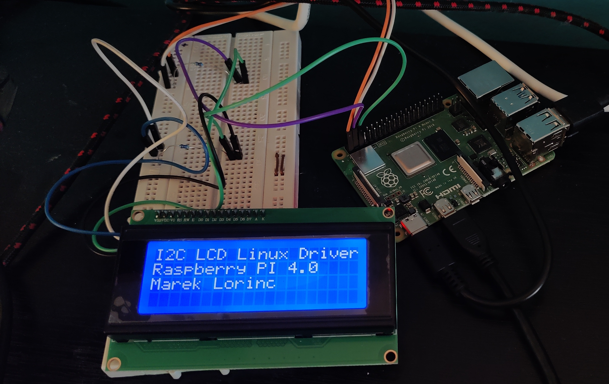

# HD44780 LCD I2C Kernel Driver for Raspberry Pi

A Linux kernel driver for HD44780-based 20x4 LCD displays with PCF8574 I2C expander, designed for Raspberry Pi. This driver provides a character device interface (`/dev/lcd0`) for easy display control from userspace.


*HD44780 20x4 LCD connected to Raspberry Pi 4 via I2C*

## Features

- ✅ Kernel-level driver with character device interface
- ✅ Device Tree overlay for proper device registration
- ✅ User-friendly command-line application
- ✅ Write to specific rows (1-4) without clearing others
- ✅ Clear display command
- ✅ Comprehensive input validation and error handling
- ✅ Buffer overflow protection

## Hardware Requirements

- Raspberry Pi (tested on Raspberry Pi 4)
- HD44780-compatible 20x4 LCD display
- PCF8574 I2C expander module
- I2C connection (SDA, SCL, VCC, GND)
- (Optional) Pullup resistors - 4.7kΩ

## Wiring

| LCD I2C Module | Raspberry Pi |
|----------------|--------------|
| VCC            | 5V (Pin 2)   |
| GND            | GND (Pin 6)  |
| SDA            | GPIO 2 (Pin 3) |
| SCL            | GPIO 3 (Pin 5) |

## Prerequisites

Install required packages:

```bash
sudo apt update
sudo apt install raspberrypi-kernel-headers build-essential device-tree-compiler
```

Enable I2C interface:

```bash
sudo raspi-config
# Navigate to: Interface Options → I2C → Enable
```

Reboot after enabling I2C:

```bash
sudo reboot
```

Verify I2C is working and detect your LCD address:

```bash
sudo i2cdetect -y 1
```

Common I2C addresses are `0x27` or `0x3F`.

## Installation

### 1. Clone the repository

```bash
git clone https://github.com/yourusername/lcd-i2c-driver.git
cd lcd-i2c-driver
```

### 2. Configure I2C address (if needed)

If your LCD uses address `0x3F` instead of `0x27`, edit `testoverlay.dts`:

```dts
lcd@27 {
    compatible = "hd44780,lcd-i2c";
    reg = <0x3F>;  // Change to your address
    status = "okay";
};
```

### 3. Build everything

```bash
make
```

This will compile:
- Kernel module (`dt_i2c.ko`)
- Device Tree overlay (`testoverlay.dtbo`)
- User application (`lcd_write`)

### 4. Install Device Tree overlay

```bash
sudo cp testoverlay.dtbo /boot/overlays/
```

Edit `/boot/config.txt`:

```bash
sudo nano /boot/config.txt
```

Add at the end:

```
dtoverlay=testoverlay
```

### 5. Reboot

```bash
sudo reboot
```

### 6. Load the kernel module

```bash
cd lcd-i2c-driver
sudo insmod dt_i2c.ko
```

Verify the module is loaded:

```bash
lsmod | grep dt_i2c
ls -l /dev/lcd0
```

Check kernel messages:

```bash
dmesg | tail -20
```

You should see:
```
LCD I2C driver probing
LCD I2C driver initialized successfully
```

## Usage

### Command-line application

Write to specific rows (1-4):

```bash
./lcd_write 1 "Hello World"
./lcd_write 2 "Raspberry Pi 4"
./lcd_write 3 "Temperature: 25C"
./lcd_write 4 "Status: OK"
```

Clear the entire display:

```bash
./lcd_write clear
```

### Install system-wide (optional)

```bash
sudo cp lcd_write /usr/local/bin/
sudo chmod 755 /usr/local/bin/lcd_write
```

Then use from anywhere:

```bash
lcd_write 1 "System Ready"
```

### Using in scripts

```bash
#!/bin/bash

lcd_write clear
lcd_write 1 "System Info"
lcd_write 2 "IP: $(hostname -I | cut -d' ' -f1)"
lcd_write 3 "CPU: $(vcgencmd measure_temp | cut -d'=' -f2)"
lcd_write 4 "$(date '+%H:%M:%S')"
```

### Set non-root permissions (optional)

Create udev rule:

```bash
echo 'KERNEL=="lcd0", MODE="0666"' | sudo tee /etc/udev/rules.d/99-lcd.rules
sudo udevadm control --reload-rules
sudo udevadm trigger
```

## Auto-load on boot

### Method 1: Load module automatically

```bash
sudo cp dt_i2c.ko /lib/modules/$(uname -r)/extra/
sudo depmod -a
echo "dt_i2c" | sudo tee -a /etc/modules
```

### Method 2: Use systemd service

Create `/etc/systemd/system/lcd-driver.service`:

```ini
[Unit]
Description=LCD I2C Kernel Driver
After=multi-user.target

[Service]
Type=oneshot
ExecStart=/sbin/insmod /home/pi/lcd-i2c-driver/dt_i2c.ko
ExecStop=/sbin/rmmod dt_i2c
RemainAfterExit=yes

[Install]
WantedBy=multi-user.target
```

Enable and start:

```bash
sudo systemctl enable lcd-driver.service
sudo systemctl start lcd-driver.service
```

## Unloading the module

```bash
sudo rmmod dt_i2c
```

If module is in use:

```bash
# Unbind I2C device first (adjust address if needed)
echo "1-0027" | sudo tee /sys/bus/i2c/devices/1-0027/driver/unbind
sudo rmmod dt_i2c
```

## Project Structure

```
lcd-i2c-driver/
├── dt_i2c.c           # Kernel driver source
├── lcd_write.c        # User application source
├── testoverlay.dts    # Device Tree overlay
├── Makefile           # Build configuration
└── README.md          # This file
```

## Technical Details

### Character Device Protocol

The driver accepts two formats via `/dev/lcd0`:

1. **Write to specific row**: `"ROW message"` where ROW is 0-3
   - Example: `echo "2 Hello" > /dev/lcd0`
   
2. **Clear display**: `"CLEAR"`
   - Example: `echo "CLEAR" > /dev/lcd0`

The `lcd_write` application handles the conversion from user-friendly rows (1-4) to internal rows (0-3).

### LCD Specifications

- **Display**: 20 columns × 4 rows
- **Controller**: HD44780 compatible
- **I2C Expander**: PCF8574
- **Interface**: 4-bit mode
- **Backlight**: Always on (controlled via `LCD_BACKLIGHT` flag)

### Row Memory Addresses

For 20x4 displays, the HD44780 uses these DDRAM addresses:
- Row 1 (0): 0x00 - 0x13
- Row 2 (1): 0x40 - 0x53
- Row 3 (2): 0x14 - 0x27
- Row 4 (3): 0x54 - 0x67

## Troubleshooting

### Display shows garbage or nothing

1. Check contrast adjustment potentiometer on I2C module
2. Verify I2C address: `sudo i2cdetect -y 1`
3. Check wiring connections
4. Review kernel logs: `dmesg | grep -i lcd`

### Module won't unload

```bash
# Check what's using it
lsmod | grep dt_i2c

# Check if device is open
lsof | grep /dev/lcd0

# Force unbind
echo "1-0027" | sudo tee /sys/bus/i2c/devices/1-0027/driver/unbind
sudo rmmod dt_i2c
```

### Permission denied

```bash
# Run with sudo
sudo ./lcd_write 1 "Test"

# Or add udev rule (see above)
```

### Compilation errors

Ensure kernel headers match your kernel:

```bash
uname -r
dpkg -l | grep raspberrypi-kernel-headers
```

If mismatch, update:

```bash
sudo apt update
sudo apt install --reinstall raspberrypi-kernel-headers
```

## Development

### Rebuilding

```bash
make clean
make
sudo rmmod dt_i2c  # if already loaded
sudo insmod dt_i2c.ko
```

### Kernel Messages

View driver messages:

```bash
dmesg | grep LCD
dmesg | tail -f  # Follow live
```

### Testing

```bash
# Test all rows
for i in {1..4}; do
    ./lcd_write $i "Test Row $i"
    sleep 1
done

# Test clear
sleep 2
./lcd_write clear
```

## Contributing

Contributions are welcome! Please feel free to submit a Pull Request.

## Author

Marek Lorinc

## Acknowledgments

- HD44780 datasheet and community documentation
- Linux kernel I2C subsystem documentation
- Raspberry Pi community

## References

- [HD44780 Datasheet](https://www.sparkfun.com/datasheets/LCD/HD44780.pdf)
- [PCF8574 Datasheet](https://www.nxp.com/docs/en/data-sheet/PCF8574_PCF8574A.pdf)
- [Linux I2C Documentation](https://www.kernel.org/doc/html/latest/i2c/index.html)
- [Device Tree Overlay Guide](https://www.raspberrypi.com/documentation/computers/configuration.html#device-trees-overlays-and-parameters)
